# broken-app — поиск ошибок и оптимизация

[](https://github.com/meonisk/broken-app/actions/workflows/ci.yml)

> Текст этого README написан Claude (Anthropic, модель Opus 5).

Проектная работа модуля 5. В исходном коде посажены дефекты — от undefined
behavior до квадратичных алгоритмов. Их надо найти динамическим анализом,
исправить, закрыть тестами, спрофилировать горячий путь и оптимизировать,
подтвердив результат замерами на одинаковых входах.

Эталон поведения — <https://github.com/meonisk/reference-app>, неизменённый
исходник из задания, коммит `f6d62a0`. Он не копировался сюда и не подключён
зависимостью: по нему сверялось ожидаемое поведение, а результат зафиксирован
тестами. Вывод `cargo run --bin demo` в обоих проектах совпадает построчно.

Это единственный отчёт по работе: ниже и находки, и замеры, и профиль.

## Чем всё сделано

Своего инструментария в репозитории нет — ни генераторов отчётов, ни самописных
счётчиков. Всё считают готовые программы, и считают они в CI: две кнопки на весь
проект. Числа и картинки ниже — их вывод, текст вокруг написан руками.

| Инструмент | Что даёт | Где лежит |
|---|---|---|
| gdb | подтверждение прогона отладчиком, кадр падения | `artifacts/*/gdb.txt` |
| Miri | UB: выход за границы, use-after-free, гонки | `artifacts/*/miri.txt` |
| Valgrind memcheck | утечки и ошибки работы с памятью | `artifacts/*/valgrind.txt` |
| ASan / TSan | те же ошибки на настоящем железе | `artifacts/*/asan.txt`, `tsan.txt` |
| criterion 0.5 | время, доверительные интервалы, все графики | `artifacts/criterion/` |
| critcmp | сравнение базовых линий, выгрузка в json | `artifacts/critcmp.txt`, `baseline-*.json` |
| Valgrind callgrind | инструкции, детерминированно | `artifacts/*/callgrind.txt` |
| Valgrind DHAT | аллокации, обращения к куче | `artifacts/*/dhat.txt`, `dhat.json` |
| cargo-flamegraph | профиль (perf + inferno) | `artifacts/*/flamegraph.svg` |

Два workflow: [`analysis.yml`](.github/workflows/analysis.yml) — корректность,
запускается на нужном коммите; [`bench.yml`](.github/workflows/bench.yml) — все
замеры, одним прогоном на одной машине.

## Что нашлось

| # | Где | Что не так | Чем найдено | Тест |
|---|-----|-----------|-------------|------|
| 1 | `sum_even` | `get_unchecked(idx)` в цикле `0..=len` — чтение за границей среза | gdb, Miri, ASan | `sum_even_handles_empty_slice`, `sum_even_sums_only_even_values` |
| 2 | `leak_buffer` | `Box::into_raw` без парного `from_raw` — утечка на каждый вызов | Valgrind (`5 bytes definitely lost`), ASan, Miri | `tests/leak.rs` |
| 3 | `normalize` | удалялся только пробел U+0020, табуляции и переводы строк оставались | `cargo test` | `normalize_removes_all_whitespace` |
| 4 | `average_positive` | сумма положительных делилась на длину всего среза | `cargo test` | `average_positive_ignores_non_positive` |
| 5 | `use_after_free` | разыменование указателя после `drop` | gdb, Miri, ASan (`heap-use-after-free`) | `use_after_free_returns_the_boxed_value` |
| 6 | `slow_dedup` | линейный поиск и сортировка на каждой вставке, O(n² log n) | criterion (284 мс), callgrind (57% инструкций) | `dedup_returns_sorted_unique_values` + бенчмарк |
| 7 | `slow_fib` | экспоненциальная рекурсия | criterion (6,2 мс) | `fib_matches_known_values` + бенчмарк |
| 8 | `race_increment` | `static mut` без синхронизации — гонка данных | Miri, TSan | `counter_keeps_every_increment_and_is_visible_after_join` |
| 9 | `read_after_sleep` | `sleep` вместо синхронизации, чтение того же `static mut` | Miri, TSan | тот же тест |

Гонка не теоретическая: четыре потока по 10 000 инкрементов дали **30 488**
вместо 40 000 — потерялась четверть записей.

Дефект 1 стоит отдельного слова. Он ловится проверкой предусловий
`get_unchecked` и роняет процесс целиком (`non-unwinding panic`), поэтому и
`cargo test`, и Miri, и санитайзеры в CI запускают **каждый тест отдельным
процессом** — иначе в логе была бы видна только первая находка.

### Отладчик

Под gdb дефект 1 виден с точностью до строки — [`artifacts/before/gdb.txt`](artifacts/before/gdb.txt):

```
Thread 2 "sum_even_handle" received signal SIGABRT, Aborted.
#13 core::slice::index::{impl#2}::get_unchecked::precondition_check (this=0, len=0)
#16 broken_app::sum_even (values=...) at src/lib.rs:11
#17 regression::sum_even_handles_empty_slice () at tests/regression.rs:9
```

Дефект 5 отладчик показывает значением: вместо 84 из освобождённой памяти
читается `3215183` — мусор, который туда успел попасть.

## Состояние до и после

| Прогон | До исправлений | После исправлений | После оптимизации |
|---|---|---|---|
| `cargo test` | 6 ок, 9 с ошибкой | 15 / 0 | 15 / 0 |
| Miri | 10 тестов из 15 с UB | чисто | чисто |
| Valgrind | 5 байт `definitely lost` | 0 | 0 |
| ASan | 6 ок, 9 с ошибкой | 15 / 0 | 15 / 0 |
| TSan | 6 ок, 9 с ошибкой | 14 / 1 | 15 / 0 |

Единственная единица в этой таблице — тест на утечку под TSan на промежуточной
стадии. Ложное срабатывание: счётчик аллокаций видел ещё и аллокации самого
санитайзера. Valgrind на том же коммите показывает `definitely lost: 0`, а
после оптимизации `leak_buffer` не аллоцирует вовсе, и стадия чиста всеми пятью
инструментами.

## Оптимизации

Мерили после исправлений, на корректном коде: пока `sum_even` читает за границей
среза, мерить нечего. Кого переписывать, видно из первых же замеров — 284 мс и
6,2 мс против 14 мкс у соседей.

**Алгоритмические.** `slow_dedup` собирал уникальные значения линейным поиском
по накопленному вектору и после каждой вставки сортировал его целиком —
O(n² log n). Теперь это `HashSet` и одна сортировка в конце, O(n + k log k).
`slow_fib` пересчитывал одни и те же числа в двух ветках рекурсии; итеративный
проход считает каждое один раз.

**Микро.** `normalize` делал три прохода и две промежуточные строки
(`split_whitespace().collect()`, затем `to_lowercase()`); стало — один проход в
заранее выделенный буфер, с отдельной веткой для ASCII, где регистр меняется
без разбора юникодных таблиц. `leak_buffer` копировал вход в кучу, чтобы просто
посчитать байты, — копия убрана, функция больше не аллоцирует вовсе.

## Замеры

Всё ниже — из одного прогона [`bench.yml`](.github/workflows/bench.yml): на одной
машине снимается базовая линия на коде до оптимизации, потом `src/` подменяется
на текущий и замер повторяется против этой линии. Бенчмарки и входы при этом не
меняются вообще, меняется только `src/`.

### Время

`cargo bench -- --baseline fixed`, [`after/criterion.txt`](artifacts/after/criterion.txt):

| Бенчмарк | До | После | Изменение, 95% ДИ |
|---|---|---|---|
| `dedup_20k` | 284,30 мс | 904,83 мкс | **−99,683%** (−99,686 … −99,679) |
| `fib_32` | 6,1527 мс | 5,5816 нс | **−100,000%** |
| `normalize_700k` | 1,4043 мс | 1,0790 мс | **−24,386%** (−25,839 … −23,037) |
| `sum_even_50k` | 13,680 мкс | 17,408 мкс | +10,111% (+4,707 … +16,211) |

То же от critcmp, [`critcmp.txt`](artifacts/critcmp.txt) — левое число говорит,
во сколько раз колонка медленнее быстрейшей в строке:

```
group             fixed                                       new
-----             -----                                       ---
dedup_20k         315.39   284.3±3.94ms        ? ?/sec        1.00   901.4±47.92µs        ? ?/sec
fib_32            1097246.14     6.2±0.02ms        ? ?/sec    1.00      5.6±0.28ns        ? ?/sec
normalize_700k    1.32  1432.4±116.94µs        ? ?/sec        1.00  1083.1±50.45µs        ? ?/sec
sum_even_50k      1.00     13.7±0.65µs        ? ?/sec         1.10     15.1±4.03µs        ? ?/sec
```

`sum_even` между стадиями не менялся ни на строку, и его +10% — чистый шум
раннера. Это полезная строка: она показывает, что на общем железе колебания
доходят до ±16%, а значит −24% у `normalize` уже за пределами шума, и criterion
это подтверждает (p < 0,05).

### Инструкции

Время на общем раннере плавает, счётчик инструкций — нет. `valgrind --tool=callgrind`
на том же бенчмарке в режиме `--bench --test`, где каждый бенчмарк прогоняется
ровно один раз:

| | До | После |
|---|---|---|
| инструкций (`Ir`) | 3 492 733 986 | 28 537 995 |

**В 122 раза меньше**, и это число повторяется от прогона к прогону.

### Аллокации

`valgrind --tool=dhat`, [`fixed/dhat.txt`](artifacts/fixed/dhat.txt) и
[`after/dhat.txt`](artifacts/after/dhat.txt):

| Показатель | До | После |
|---|---|---|
| всего выделено | 4 055 509 байт в 895 блоках | 3 432 525 байт в 866 блоках |
| пик (`t-gmax`) | 1 759 452 байт в 137 блоках | 1 435 164 байт в 136 блоках |
| прочитано из кучи | 4 804 672 549 байт | 7 602 262 байт |
| записано в кучу | 3 896 300 байт | 6 555 476 байт |

Главное здесь — чтения: 4,8 ГБ против 7,6 МБ, **в 632 раза меньше**. Это тот
самый линейный поиск в `slow_dedup`, который на каждой вставке перечитывал весь
накопленный вектор. Записей, наоборот, стало больше: `HashSet` раскладывает
значения по корзинам, а сортировка почти упорядоченного вектора только читала.

## Профиль

### Где было узко

callgrind показывает не доли выборок, а точные инструкции по функциям
([`fixed/callgrind.txt`](artifacts/fixed/callgrind.txt)):

| Доля | Инструкций | Кадр |
|---|---|---|
| 28,63% | 1 000 028 970 | `core::slice::sort::unstable::ipnsort` — сортировка из `slow_dedup` |
| 22,91% | 800 040 001 | `slow_dedup`, разыменование указателей при линейном поиске |
| 11,46% | 400 180 002 | `slow_dedup`, итератор по срезу |
| 11,45% | 400 080 022 | `slow_dedup`, собственно `src/algo.rs` |
| 11,45% | 400 000 190 | `slow_dedup`, сравнения |
| 2,04% | 71 323 483 | `slow_fib` |

`slow_dedup` вместе с сортировкой, которую он же и вызывает, — это 86% всех
инструкций программы. Его и переписывали первым.

После оптимизации ([`after/callgrind.txt`](artifacts/after/callgrind.txt)) в
верхних строках `normalize` (около 54% от уже в 122 раза меньшего числа) и
раскладка `HashSet` по корзинам (12,33%). `slow_dedup` из верхних строк ушёл,
`slow_fib` не виден вовсе.

### Флеймграфы

`cargo flamegraph` на том же бенчмарке в режиме criterion `--profile-time 5`: он
гоняет каждый бенчмарк ровно пять секунд без анализа, специально для
профилировщика. Слоты при этом равные — каждому бенчмарку своя четверть времени,
— так что картинка отвечает не на вопрос «что дороже», а на вопрос «на что
уходит время внутри слота». Что дороже, сказал callgrind выше.

[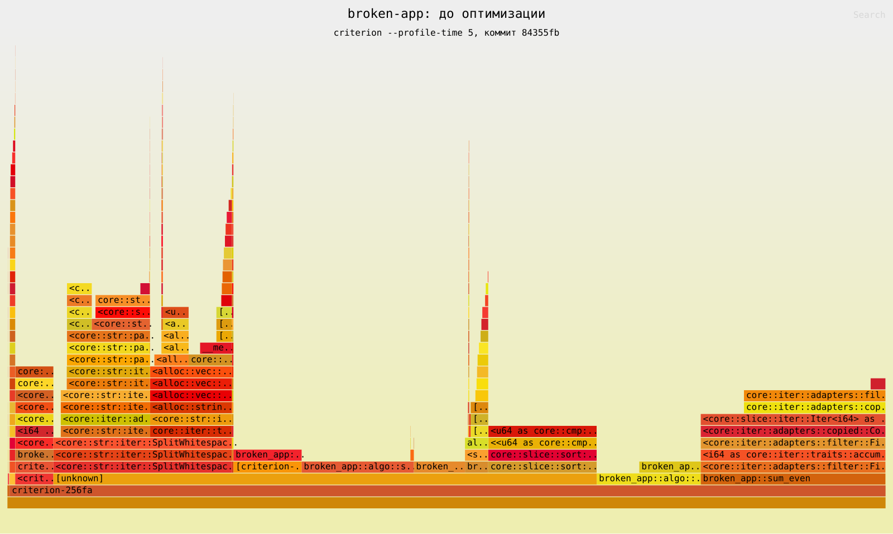](artifacts/fixed/flamegraph.svg)

*До оптимизации. `slow_dedup` (12,78%) и сортировка, которую он вызывает изнутри
цикла (12,34%), вдвоём занимают все свои 25% — на полезную работу времени не
остаётся.*

[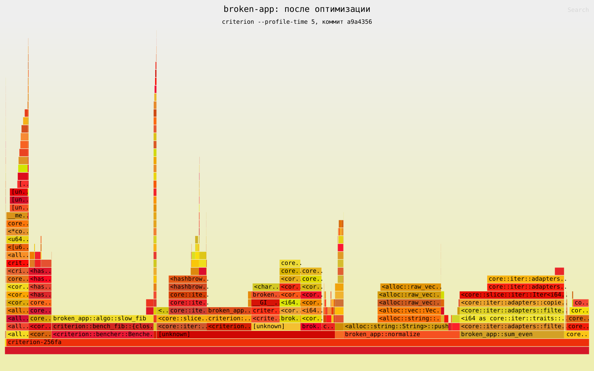](artifacts/after/flamegraph.svg)

*После. Та же четверть времени, но `slow_dedup` вместе с сортировкой и хеш-таблицей
укладывается в 2,4%: 12,78 + 12,34 → 1,46 + 0,46 + 0,49. Остальное съедает
обвязка criterion, которой теперь есть чем заняться.*

Картинки кликаются — рядом лежат `.svg`, в них работает поиск по кадрам.

`slow_fib` на обеих картинках занимает примерно поровну — 7,77% и 7,61%, — и это
не ошибка: за отведённые пять секунд итеративная версия успевает отработать
около 900 миллионов раз, а рекурсивная успевала 800. Ускорение fib видно в
замерах и в инструкциях, но не в равных слотах профиля.

## Графики criterion

Отчёт criterion сохранён целиком, как он его собрал:
[`artifacts/criterion/report/index.html`](artifacts/criterion/report/index.html)
— около пятидесяти графиков на бенчмарк, открывается локально. Ниже вынесены три
на каждый, чтобы читались прямо здесь.

### `dedup_20k`

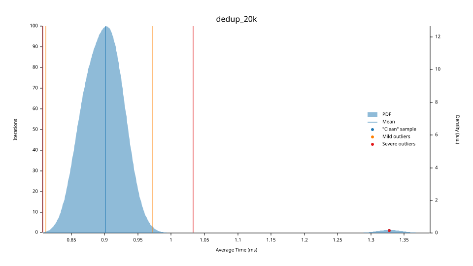

*Плотность времени итерации: закрашенная область — распределение, вертикальные
линии — среднее и границы выбросов.*

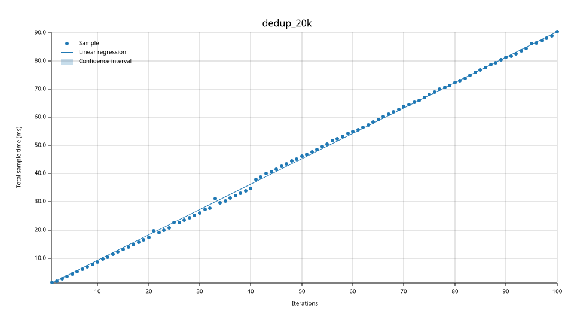

*Суммарное время против числа итераций. Точки ложатся на прямую — замер
устойчив, наклону можно верить.*

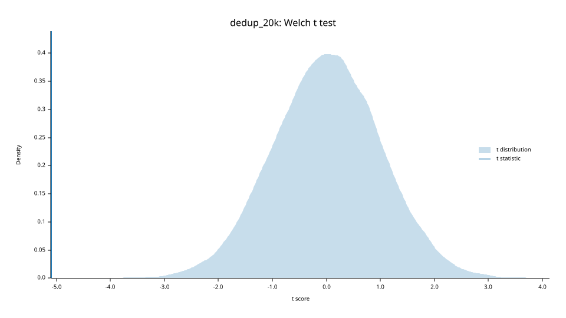

*t-тест против базовой линии: отметка далеко за закрашенной областью — разница
не случайна.*

### `fib_32`


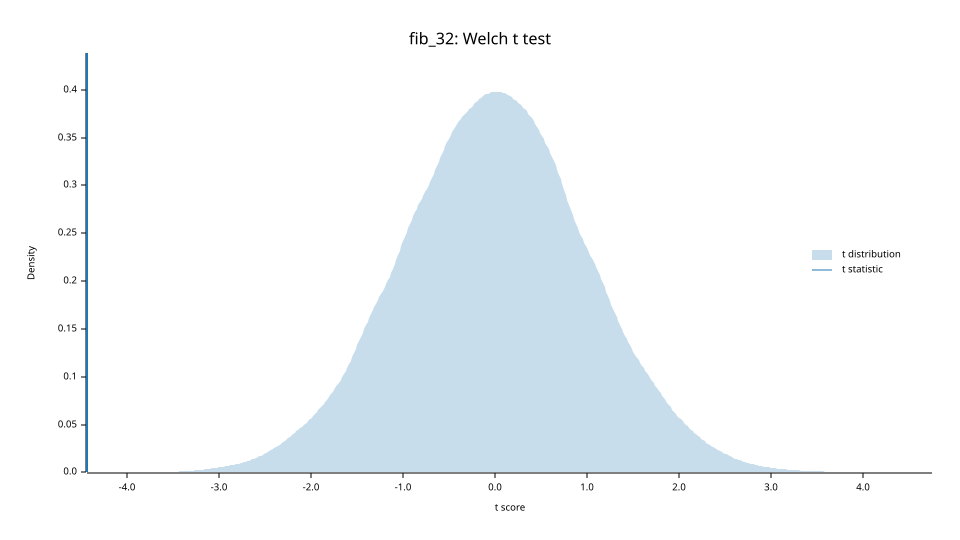

### `normalize_700k`

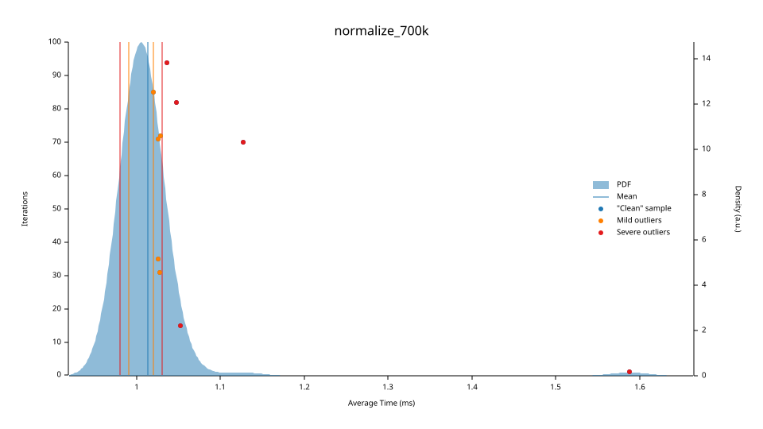

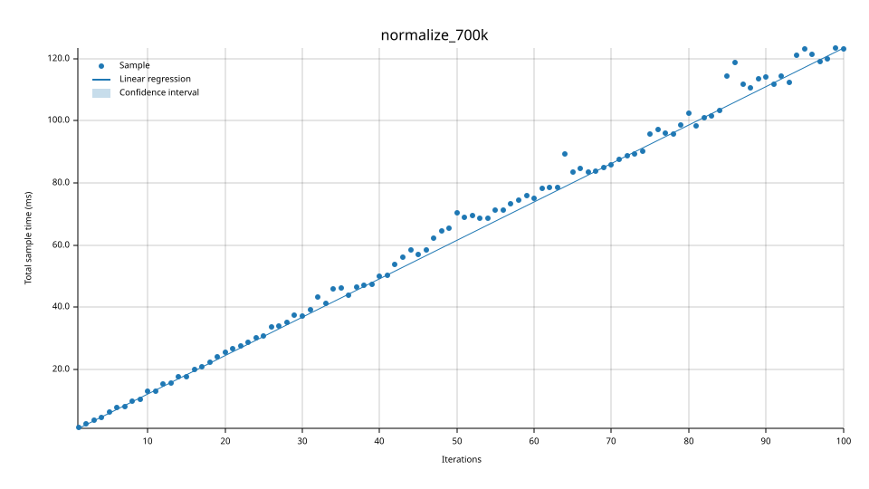


### `sum_even_50k`

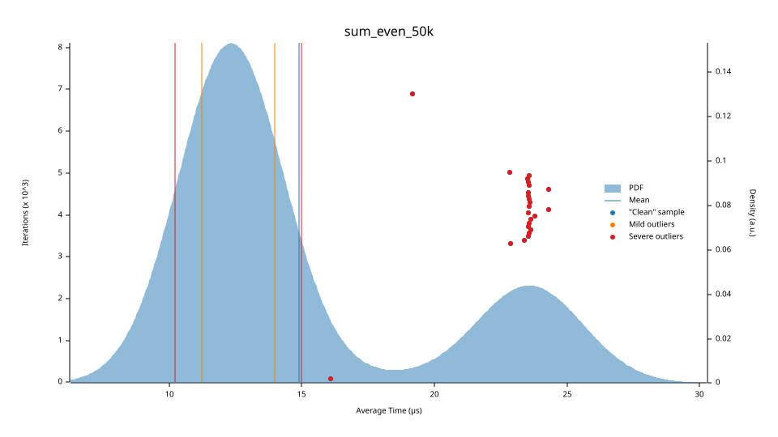

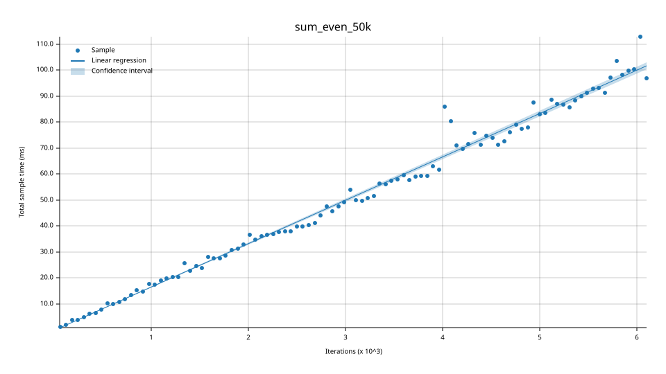

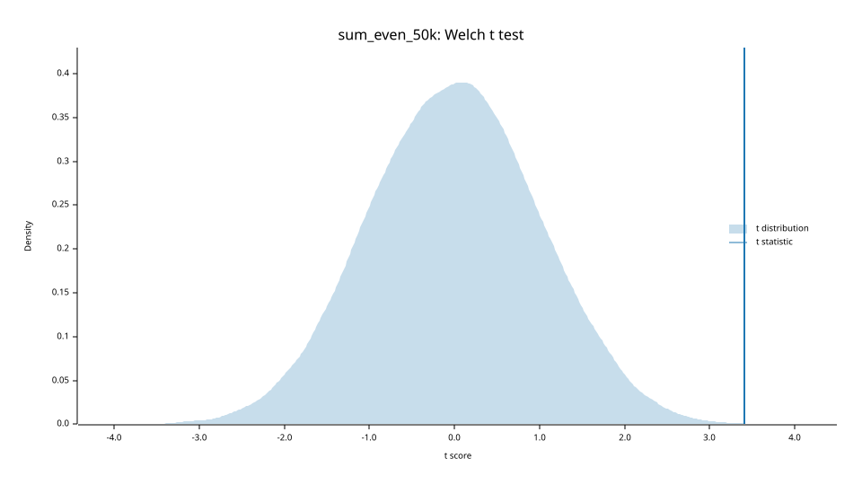

Наложение обеих выборок criterion тоже рисует (`report/both/pdf.svg`), но при
разнице в 315 раз одна кривая вырождается в линию у нуля — в каталоге лежит, в
текст выносить нечего.

## Структура

```
src/lib.rs            sum_even, leak_buffer, normalize, average_positive, use_after_free
src/algo.rs           slow_dedup, slow_fib
src/concurrency.rs    race_increment, read_after_sleep, reset_counter
src/bin/demo.rs       демонстрация, вывод совпадает с эталоном

tests/integration.rs  исходные тесты из задания
tests/regression.rs   по тесту на каждый дефект
tests/leak.rs         утечка: аллокации считает stats_alloc

benches/criterion.rs  criterion, фиксированные входы и имена

artifacts/before/     анализ на исходном коде
artifacts/fixed/      анализ и замеры после исправлений, до оптимизации
artifacts/after/      то же после оптимизации
artifacts/criterion/  отчёт criterion целиком, как он его собрал
artifacts/critcmp.txt сравнение базовых линий
```

В `before/`, `fixed/` и `after/` лежат логи `cargo test`, gdb, Miri, Valgrind,
ASan и TSan; в `fixed/` и `after/` — ещё `criterion.txt`, `callgrind.txt`,
`dhat.txt` и профиль.

Имена `slow_dedup` и `slow_fib` оставлены как в задании: переименование
потянуло бы за собой тесты, бенчмарки и demo, а идентификаторы бенчмарков
должны совпадать между прогонами, иначе criterion не сопоставит замеры.

Из зависимостей — только `criterion` и `stats_alloc`, обе для разработки, в
собранный бинарник не попадают. `stats_alloc` взят вместо сорока строк своего
`GlobalAlloc`: считать аллокации в тесте всё равно надо, а писать для этого
аллокатор руками — то же самое, только своё и без тестов.

## Как воспроизвести

```bash
cargo build --workspace
```

```bash
cargo test
```

Ожидается 15 тестов: 6 исходных, 8 регрессионных и 1 на утечку.

```bash
cargo run --bin demo
```

### Динамический анализ

Отладчик, Miri, Valgrind, ASan и TSan гоняются на Linux в CI — workflow
принимает коммит и имя набора логов:

```bash
gh workflow run analysis.yml -f ref=$(git rev-parse HEAD) -f stage=after
```

Работа велась на Windows, где Valgrind не существует, а TSan не поддерживается
для `x86_64-pc-windows-msvc`. Ставить WSL ради двух инструментов смысла было
меньше, чем прогонять всё на настоящем Linux в CI: там же ставится nightly с
Miri, и логи выкладываются артефактом прогона. Локально то же самое:

```bash
cargo +nightly miri test
```

```bash
valgrind --leak-check=full ./target/debug/deps/regression-<hash>
```

### Замеры и профиль

Одна кнопка, обе стадии, одна машина:

```bash
gh workflow run bench.yml -f base=84355fb
```

Локально то же самое делается тремя командами — на коде до оптимизации, потом на
текущем:

```bash
cargo bench -- --save-baseline fixed
```

```bash
cargo bench -- --baseline fixed
```

```bash
critcmp fixed new
```

Аргументы бенчмарков спрятаны за `black_box`: без этого `fib(32)` сворачивался
компилятором в константу и бенчмарк мерил чтение из памяти.

## Окружение

```
rustc 1.97.1 (stable)          сборка, тесты, бенчмарки
nightly + miri                 динамический анализ
criterion 0.5, stats_alloc 0.1
valgrind 3.22 (memcheck, callgrind, dhat)
edition 2024
цель: x86_64-unknown-linux-gnu (все замеры и логи), x86_64-pc-windows-msvc (разработка)
```
