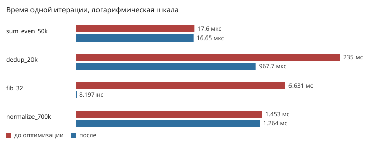
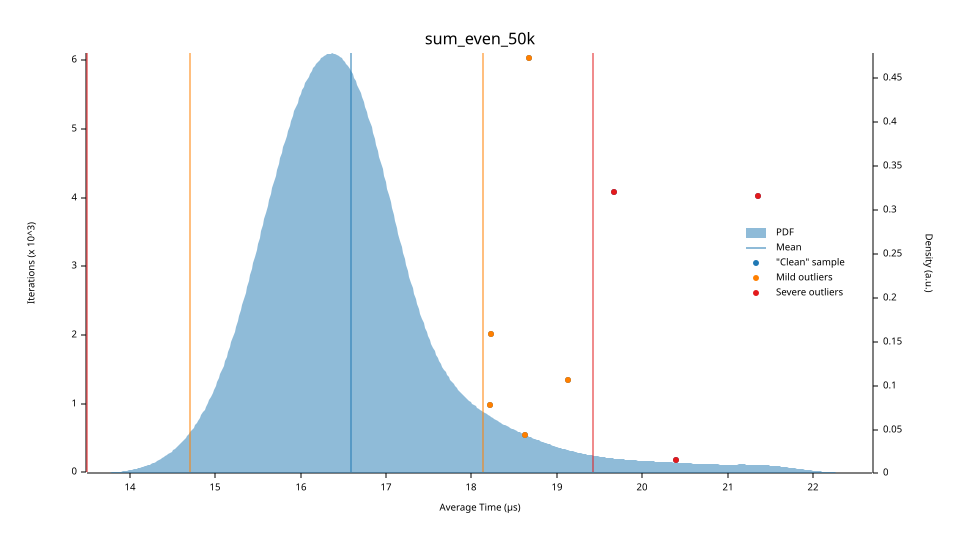
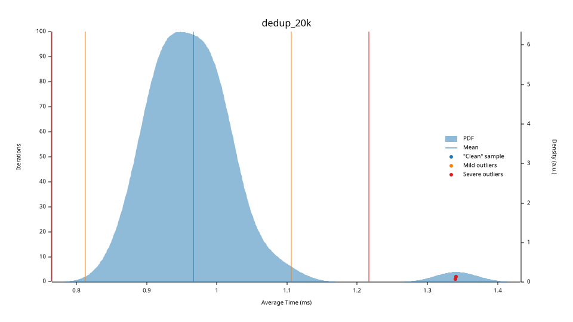
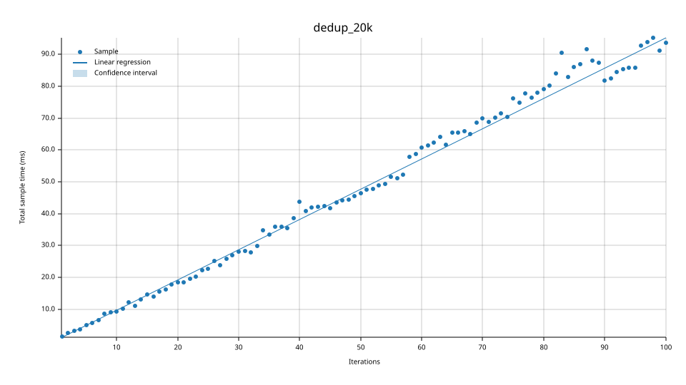
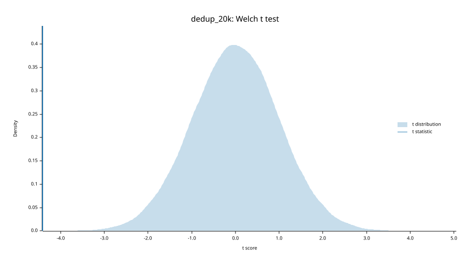
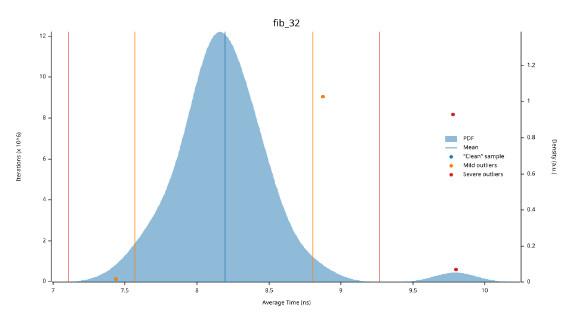
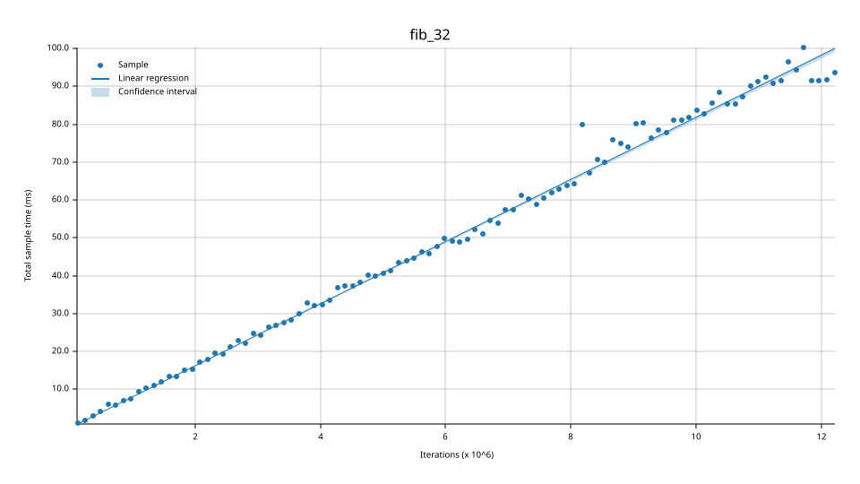
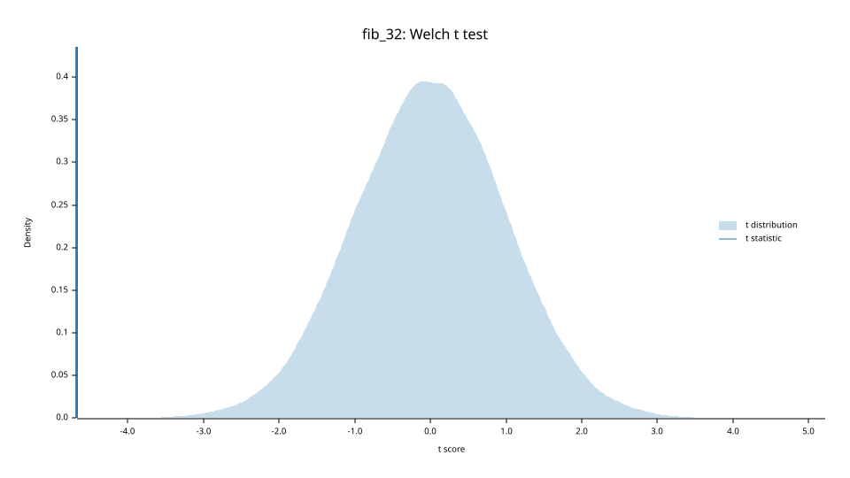
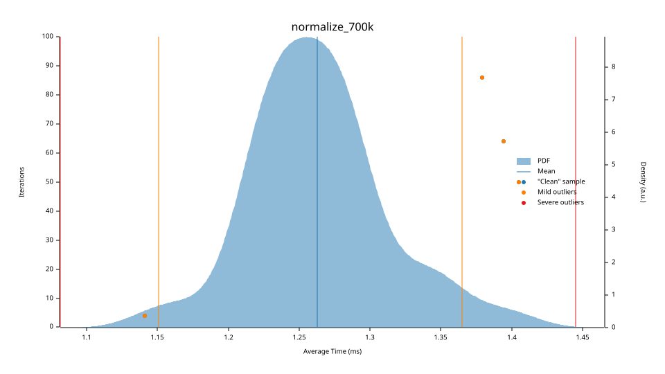
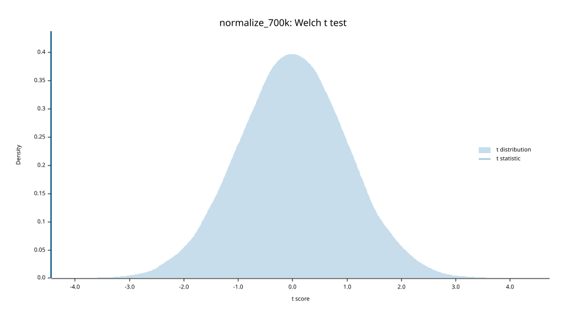

# Бенчмарки

Замеры criterion на одних и тех же входах: `fixed` — код исправлен, но ещё
не оптимизирован, `after` — после оптимизации. Имена бенчмарков между
прогонами не менялись, иначе criterion не сопоставил бы замеры.

## Сводка

| Бенчмарк | До оптимизации | После | Изменение среднего, 95% ДИ |
|---|---|---|---|
| [`sum_even_50k`](#sum_even_50k) | 17.6 мкс | 16.65 мкс | -16.22% (-20.13 … -12.30) |
| [`dedup_20k`](#dedup_20k) | 235 мс | 967.7 мкс | -99.59% (-99.60 … -99.58) |
| [`fib_32`](#fib_32) | 6.631 мс | 8.197 нс | -100.00% (-100.00 … -100.00) |
| [`normalize_700k`](#normalize_700k) | 1.453 мс | 1.264 мс | -13.87% (-15.05 … -12.71) |

## Аллокации на вызов

Считает свой `GlobalAlloc` в `benches/baseline.rs` — criterion такого не меряет.

| Нагрузка | До | После |
|---|---|---|
| sum_even 50k | 0 | 0 |
| dedup 20k | 14 | 2 |
| fib 32 | 0 | 0 |
| normalize 700k | 18 | 1 |

# По бенчмаркам

## `sum_even_50k`

| До оптимизации | После | Изменение среднего, 95% ДИ |
|---|---|---|
| 17.6 мкс | 16.65 мкс | -16.22% (-20.13 … -12.30) |

*Плотность времени одной итерации после оптимизации: закрашенная область — распределение, вертикальные линии — среднее и границы выбросов.*

*Суммарное время против числа итераций. Точки должны ложиться на прямую — если нет, замер шумит.*

*t-тест против базовой линии: отметка далеко за закрашенной областью означает, что разница не случайна.*

## `dedup_20k`

| До оптимизации | После | Изменение среднего, 95% ДИ |
|---|---|---|
| 235 мс | 967.7 мкс | -99.59% (-99.60 … -99.58) |

*Плотность времени одной итерации после оптимизации: закрашенная область — распределение, вертикальные линии — среднее и границы выбросов.*

*Суммарное время против числа итераций. Точки должны ложиться на прямую — если нет, замер шумит.*

*t-тест против базовой линии: отметка далеко за закрашенной областью означает, что разница не случайна.*

## `fib_32`

| До оптимизации | После | Изменение среднего, 95% ДИ |
|---|---|---|
| 6.631 мс | 8.197 нс | -100.00% (-100.00 … -100.00) |

*Плотность времени одной итерации после оптимизации: закрашенная область — распределение, вертикальные линии — среднее и границы выбросов.*

*Суммарное время против числа итераций. Точки должны ложиться на прямую — если нет, замер шумит.*

*t-тест против базовой линии: отметка далеко за закрашенной областью означает, что разница не случайна.*

## `normalize_700k`

| До оптимизации | После | Изменение среднего, 95% ДИ |
|---|---|---|
| 1.453 мс | 1.264 мс | -13.87% (-15.05 … -12.71) |

*Плотность времени одной итерации после оптимизации: закрашенная область — распределение, вертикальные линии — среднее и границы выбросов.*

*Суммарное время против числа итераций. Точки должны ложиться на прямую — если нет, замер шумит.*

*t-тест против базовой линии: отметка далеко за закрашенной областью означает, что разница не случайна.*

Собрано `python scripts/report.py bench`: числа из json-данных criterion,
графики — его же, скопированы в `artifacts/plots/`.
